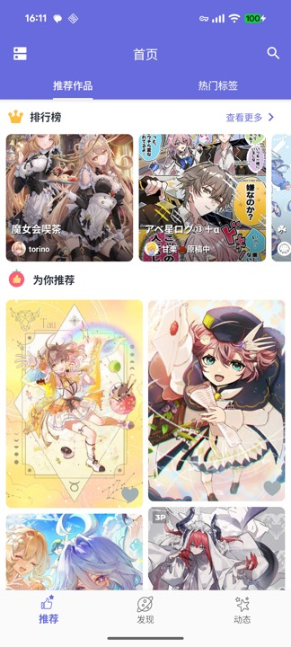
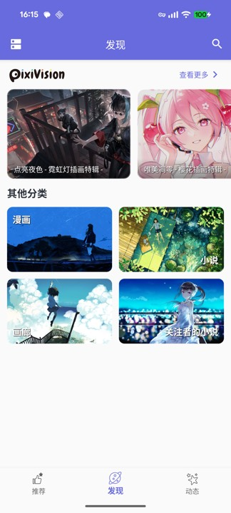
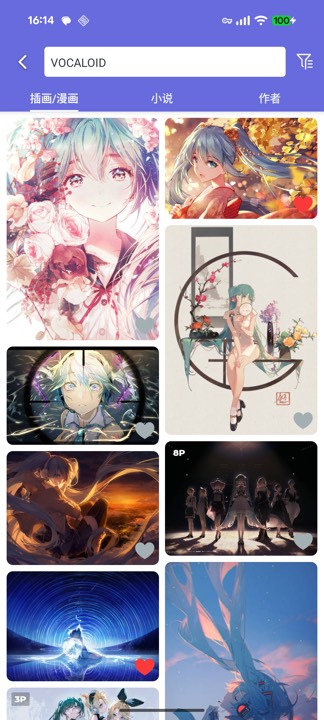
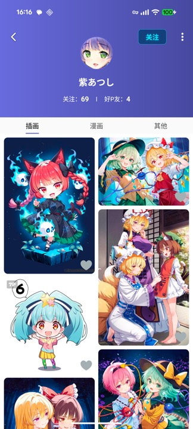
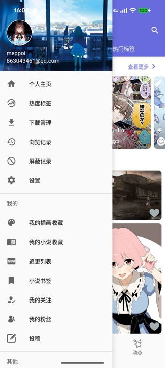
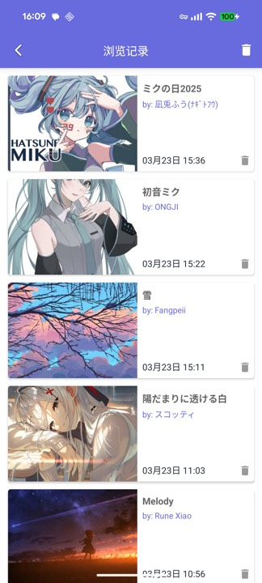

<div align="center">

# Shaft

### A Modern Third-Party Pixiv Client for Android

[](https://github.com/CeuiLiSA/Pixiv-Shaft/stargazers)
[](https://github.com/CeuiLiSA/Pixiv-Shaft/network/members)
[](https://github.com/CeuiLiSA/Pixiv-Shaft/releases/latest)
[](./LICENSE)

[](https://github.com/CeuiLiSA/Pixiv-Shaft/actions)
[](https://github.com/CeuiLiSA/Pixiv-Shaft/issues)
[](https://github.com/CeuiLiSA/Pixiv-Shaft/issues?q=is%3Aissue+is%3Aclosed)
[](https://github.com/CeuiLiSA/Pixiv-Shaft/commits)
[](https://github.com/CeuiLiSA/Pixiv-Shaft)
[](https://github.com/CeuiLiSA/Pixiv-Shaft)
[](https://github.com/CeuiLiSA/Pixiv-Shaft/graphs/contributors)
[](https://github.com/CeuiLiSA/Pixiv-Shaft/releases)

**Shaft** is a beautifully crafted, open-source Pixiv client that brings the full Pixiv experience to Android — illustrations, manga, novels, rankings, and more — with a clean Material Design interface and smooth animations.

[](https://play.google.com/store/apps/details?id=ceui.pixiv.pshaft)
&nbsp;&nbsp;
[](https://github.com/CeuiLiSA/Pixiv-Shaft/releases/latest)

---

[English](#features) | [日本語](./README/README.ja.md)

</div>

> [!NOTE]
> This is an unofficial third-party client for [Pixiv](https://www.pixiv.net). All illustrations, manga, and novel works are copyrighted by their respective creators or Pixiv. This project is open-source for learning and communication purposes only.

## Screenshots

<div align="center">
<table>
  <tr>
    <td align="center"><b>Home & Recommendations</b></td>
    <td align="center"><b>Discover</b></td>
    <td align="center"><b>Search</b></td>
  </tr>
  <tr>
    <td></td>
    <td></td>
    <td></td>
  </tr>
  <tr>
    <td align="center"><b>User Profile</b></td>
    <td align="center"><b>Navigation Drawer</b></td>
    <td align="center"><b>Browsing History</b></td>
  </tr>
  <tr>
    <td></td>
    <td></td>
    <td></td>
  </tr>
</table>
</div>

## Features

<table>
<tr>
<td width="50%" valign="top">

### Browsing & Discovery
- Personalized illustration, manga & novel recommendations
- Trending tags with real-time updates
- Daily / Weekly / Monthly rankings with date picker
- PixiVision curated articles & special features
- Related works exploration
- Illustration & novel series support

### Search & Filter
- Search illustrations, manga, novels, and users
- Sort by popularity / hotness (no premium required!)
- Filter by bookmark count threshold
- Advanced search filters

</td>
<td width="50%" valign="top">

### Social & Interaction
- View, post, and reply to comments
- Follow users, view followers & following
- Multi-account support with quick switching
- User profile with full works gallery
- Mute / block users and tags
- Spam comment filtering

### Downloads & History
- Batch download with queue management
- Export download links
- Local browsing & download history
- Customizable file naming schemes

</td>
</tr>
<tr>
<td width="50%" valign="top">

### Content Support
- GIF playback & save
- Full novel reader with series & chapters
- Novel bookmarks
- R18 content (requires Pixiv account setting)
- Reverse image search (SauceNAO / TinEye / IQDB / Ascii2D)

</td>
<td width="50%" valign="top">

### Experience
- Material Design with smooth animations
- Dark mode
- Multi-language support
- Direct connection for mainland China users
- Lightweight & battery-friendly

</td>
</tr>
</table>

## Tech Stack

```
Language        Kotlin + Java  ·  Target SDK 36 (Android 15)  ·  Min SDK 23 (Android 6.0)
Architecture    MVVM  ·  Repository Pattern  ·  Navigation Component  ·  ViewBinding
Networking      Retrofit 2  ·  OkHttp  ·  RxJava 2/3  ·  RxHttp  ·  Custom DNS & SSL
Storage         Room  ·  MMKV (Tencent)
UI              Material Design 3  ·  Glide  ·  Lottie  ·  SmartRefreshLayout  ·  ZoomImage
Build           Gradle 8.7  ·  KAPT  ·  Custom Annotation Processor  ·  ProGuard
Analytics       Firebase Analytics  ·  Firebase Crashlytics
```

## Building from Source

```bash
# Clone the repository
git clone https://github.com/CeuiLiSA/Pixiv-Shaft.git
cd Pixiv-Shaft

# Build debug APK
./gradlew assembleDebug

# Or build release APK (requires signing config)
./gradlew assembleRelease
```

**Requirements:** JDK 17+, Android SDK 36

## Contributing

Contributions are welcome! Feel free to open issues or submit pull requests.

### 🏆 Top Contributors

<table>
  <tr>
    <td align="center"><a href="https://github.com/CeuiLiSA"><br/><sub><b>🥇 CeuiLiSA</b></sub></a><br/><sub>521 commits</sub><br/><sub>+143,913 / −85,914</sub></td>
    <td align="center"><a href="https://github.com/sunbeams001"><br/><sub><b>🥈 sunbeams001</b></sub></a><br/><sub>504 commits</sub><br/><sub>+21,001 / −9,963</sub></td>
    <td align="center"><a href="https://github.com/SoxiaLiSA"><br/><sub><b>🥉 SoxiaLiSA</b></sub></a><br/><sub>332 commits</sub><br/><sub>+52,639 / −15,211</sub></td>
    <td align="center"><a href="https://github.com/4ragaki"><br/><sub><b>4ragaki</b></sub></a><br/><sub>41 commits</sub><br/><sub>+1,231 / −201</sub></td>
    <td align="center"><a href="https://github.com/duzhaokun123"><br/><sub><b>duzhaokun123</b></sub></a><br/><sub>37 commits</sub><br/><sub>+1,174 / −717</sub></td>
  </tr>
  <tr>
    <td align="center"><a href="https://github.com/0-a-e"><br/><sub><b>0-a-e</b></sub></a><br/><sub>19 commits</sub><br/><sub>+907 / −839</sub></td>
    <td align="center"><a href="https://github.com/Lostin-Tianyi"><br/><sub><b>Lostin-Tianyi</b></sub></a><br/><sub>17 commits</sub><br/><sub>+1,080 / −149</sub></td>
    <td align="center"><a href="https://github.com/SodaWithoutSparkles"><br/><sub><b>SodaWithoutSparkles</b></sub></a><br/><sub>16 commits</sub><br/><sub>+351 / −273</sub></td>
    <td align="center"><a href="https://github.com/LoxiaLiSA"><br/><sub><b>LoxiaLiSA</b></sub></a><br/><sub>14 commits</sub><br/><sub>+50,536 / −15,637</sub></td>
    <td align="center"><a href="https://github.com/yxsra"><br/><sub><b>yxsra</b></sub></a><br/><sub>11 commits</sub><br/><sub>+182 / −53</sub></td>
  </tr>
</table>

<sub>Commits from the GitHub contributors API; lines added / removed from <code>git log --numstat</code>. Snapshot taken 2026-04-21 — see the [live list](https://github.com/CeuiLiSA/Pixiv-Shaft/graphs/contributors).</sub>

### All contributors

<a href="https://github.com/CeuiLiSA/Pixiv-Shaft/graphs/contributors">
  
</a>

<br>

[](https://star-history.com/#CeuiLiSA/Pixiv-Shaft&Date)

## FAQ

Check out the [FAQ](./FAQ.md) for common questions and troubleshooting.

For customizing where files go and how they're named, see the
[Download path & filename guide](./DOWNLOAD.md).

## License

```
MIT License

Copyright (c) 2021 CeuiLiSA

Permission is hereby granted, free of charge, to any person obtaining a copy
of this software and associated documentation files (the "Software"), to deal
in the Software without restriction, including without limitation the rights
to use, copy, modify, merge, publish, distribute, sublicense, and/or sell
copies of the Software, and to permit persons to whom the Software is
furnished to do so, subject to the following conditions:

The above copyright notice and this permission notice shall be included in all
copies or substantial portions of the Software.

THE SOFTWARE IS PROVIDED "AS IS", WITHOUT WARRANTY OF ANY KIND, EXPRESS OR
IMPLIED, INCLUDING BUT NOT LIMITED TO THE WARRANTIES OF MERCHANTABILITY,
FITNESS FOR A PARTICULAR PURPOSE AND NONINFRINGEMENT. IN NO EVENT SHALL THE
AUTHORS OR COPYRIGHT HOLDERS BE LIABLE FOR ANY CLAIM, DAMAGES OR OTHER
LIABILITY, WHETHER IN AN ACTION OF CONTRACT, TORT OR OTHERWISE, ARISING FROM,
OUT OF OR IN CONNECTION WITH THE SOFTWARE OR THE USE OR OTHER DEALINGS IN THE
SOFTWARE.
```

---

<div align="center">

**If you find Shaft useful, consider giving it a star!**

[](https://github.com/CeuiLiSA/Pixiv-Shaft)

Made with love for the Pixiv community

</div>
