<div align="center">

<a href="https://pixshaft.com" title="pixshaft.com — the Shaft website">
  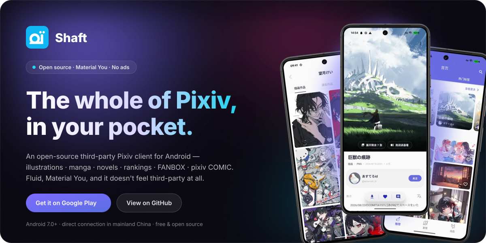
</a>

<br>

[](https://github.com/CeuiLiSA/Pixiv-Shaft/stargazers)
[](https://github.com/CeuiLiSA/Pixiv-Shaft/network/members)
[](https://github.com/CeuiLiSA/Pixiv-Shaft/releases/latest)
[](./LICENSE)

[](https://github.com/CeuiLiSA/Pixiv-Shaft/actions)
[](https://github.com/CeuiLiSA/Pixiv-Shaft/issues)
[](https://github.com/CeuiLiSA/Pixiv-Shaft/issues?q=is%3Aissue+is%3Aclosed)
[](https://github.com/CeuiLiSA/Pixiv-Shaft/commits)
[](https://github.com/CeuiLiSA/Pixiv-Shaft)
[](https://github.com/CeuiLiSA/Pixiv-Shaft)
[](https://github.com/CeuiLiSA/Pixiv-Shaft/graphs/contributors)
[](https://github.com/CeuiLiSA/Pixiv-Shaft/releases)

**PixShaft (Shaft)** is an open-source third-party Pixiv client for Android — illustrations, manga, novels, rankings, FANBOX and pixiv COMIC, all in one app. Material You, fluid, and it doesn't feel third-party at all.

[](https://play.google.com/store/apps/details?id=ceui.pixiv.pshaft)
&nbsp;&nbsp;
[](https://github.com/CeuiLiSA/Pixiv-Shaft/releases/latest)
&nbsp;&nbsp;
[](https://pixshaft.com)
&nbsp;&nbsp;
[](https://afdian.com/a/pixshaft)

<sub>Android 7.0+ · direct connection in mainland China · free, open source, no ads</sub>

---

**English** | [简体中文](./README/README.zh-CN.md) | [日本語](./README/README.ja.md)

</div>

> [!NOTE]
> This is an unofficial third-party client for [Pixiv](https://www.pixiv.net). All illustrations, manga, and novel works are copyrighted by their respective creators or Pixiv. This project is open-source for learning and communication purposes only.

<br>

<div align="center">
  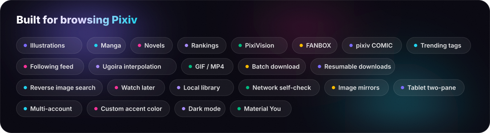
</div>

## ✨ Features

### A Pixiv client that can actually keep up
From browsing and discovery to downloads and bookmarks, from FANBOX to pixiv COMIC — everything you'd want to do on Pixiv, done properly.

<table>
<tr>
<td width="50%" valign="top">

#### 🎯 A feed made for you
Personalised illustration, manga and novel recommendations, trending tags refreshed in real time — every pull-to-refresh is a new surprise.

#### 🏆 Rankings & chart hub
Daily / weekly / monthly rankings with a date picker to revisit any day; the Discover tab adds bookmark charts, AI charts, charts by era, wallpaper charts, tag zones and artist charts.

#### 🔍 Powerful search & filters
Six sort orders, upload period, bookmark-count range, aspect ratio and resolution, a three-way AI switch — and sorting by popularity **without** Pixiv Premium.

#### 🖼️ Reverse image search
SauceNAO / TinEye / IQDB / Ascii2D, one tap to find the source.

#### 🎁 FANBOX & pixiv COMIC
Native FANBOX: post feed, recommended creators, full post bodies and plans — no more hand-off to the browser; the pixiv COMIC home lives in the app too. One account, everything connected.

#### 📖 Novel reader · local library
Series, chapters, bookmarks and a progress percentage, with related illustrations mixed in automatically; point it at a folder to read local txt files, and bookmarking saves the whole novel as TXT.

</td>
<td width="50%" valign="top">

#### 👥 Fast multi-account switching
Follows, DMs, bookmarks — hop freely between accounts.

#### ⬇️ Batch download · resumable
Queue a whole set at once and pick up from where a flaky network dropped it; batch-rename with naming templates, export captions alongside, or hand the jobs to aria2 on your NAS.

#### 🙈 Mute settings
Manage by tag and by artist separately, or mute a single work in place — cards get blurred and one tap reveals them.

#### 🔖 Watch later
Long-press a card to stash it. Purely local, never reported — collect a batch and browse at leisure.

#### 📡 Network self-check · painless direct connection
Built-in network test page: DNS, App API, web endpoints and a real image download are checked one by one, and IPv6 pollution gets called out on the spot. Slow? Switch images to pixiv.cat / pixiv.re / pixiv.nl or your own reverse proxy, or use your own App API proxy.

#### ⚡ Instant cold start · local first
Home recommendations, rankings and latest works open instantly from the last snapshot while the network refreshes quietly in the background; bookmarks and follows go into a persistent queue so a tap while offline is never lost.

</td>
</tr>
</table>

## 📱 Interface

### Every screen, polished
Real-device captures — what you see here is exactly what you get when you open the app.

<table>
<tr>
<td align="center" width="33%">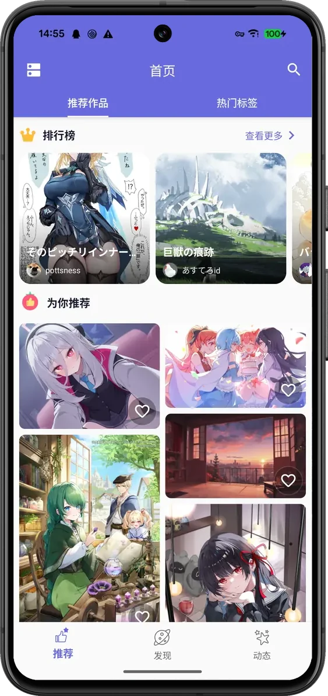<br><b>Home</b><br><sub>Recommendations & rankings, one screen away</sub><br><sub>Personalised feed · Rankings carousel · One-tap bookmark</sub></td>
<td align="center" width="33%">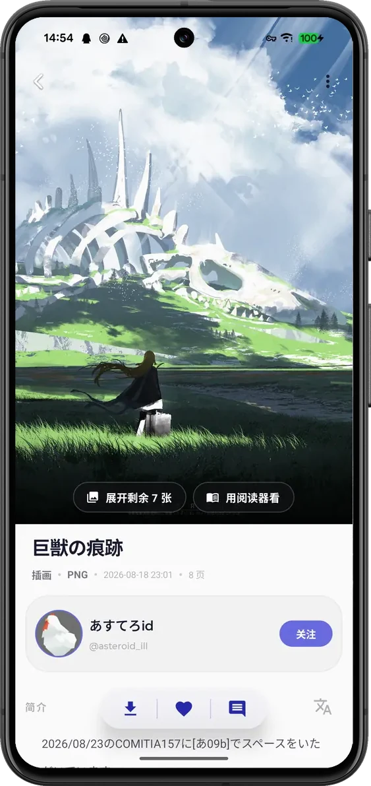<br><b>Viewer</b><br><sub>High-res viewing, every detail</sub><br><sub>Multi-page fold · Download / bookmark / comment capsule · Load original · Reverse search</sub></td>
<td align="center" width="33%">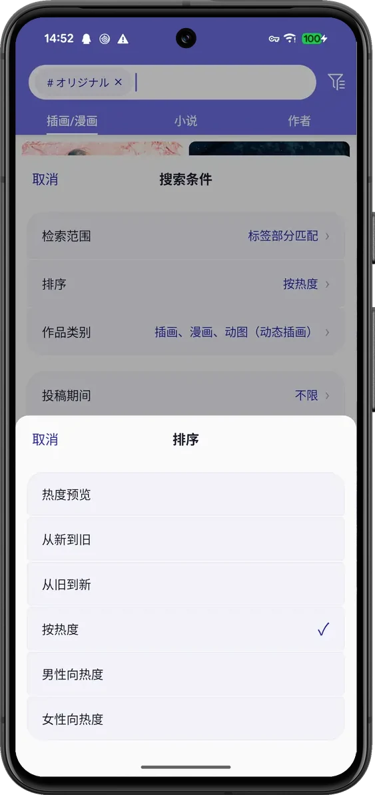<br><b>Search</b><br><sub>Exactly what you're looking for</sub><br><sub>Six sort orders · Bookmark-count range · AI three-way · Safe only</sub></td>
</tr>
<tr>
<td align="center">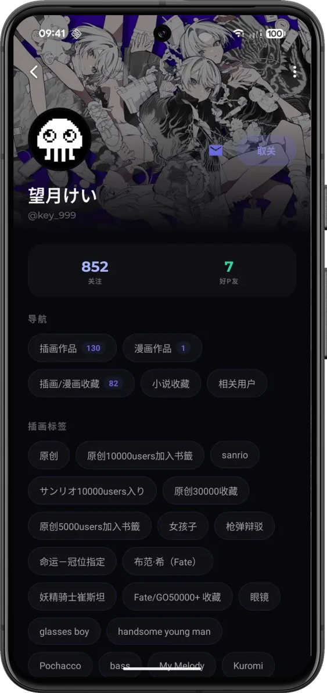<br><b>Artist</b><br><sub>Step into the artist's world</sub><br><sub>Advanced tag search · Works / bookmarks nav · Add to home screen</sub></td>
<td align="center">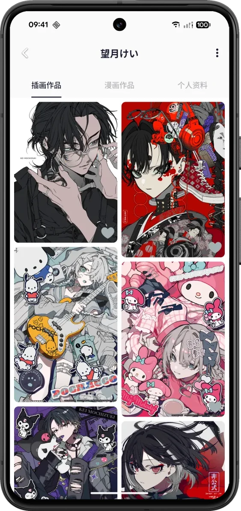<br><b>Works wall</b><br><sub>Illustrations, manga and novels, tab by tab</sub><br><sub>Waterfall gallery · Bookmark from the card · Manga series</sub></td>
<td align="center">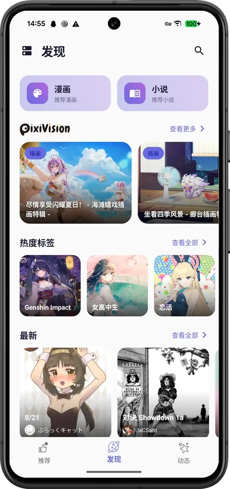<br><b>Discover</b><br><sub>Features, columns & chart hub</sub><br><sub>Manga / novel columns · PixiVision · Trending tags · Chart hub</sub></td>
</tr>
<tr>
<td align="center">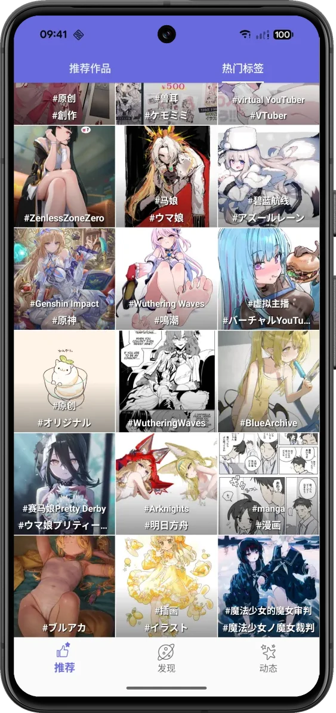<br><b>Trending tags</b><br><sub>Live trends, with cover previews</sub><br><sub>Real-time tags · Cover preview · One tap in</sub></td>
<td align="center">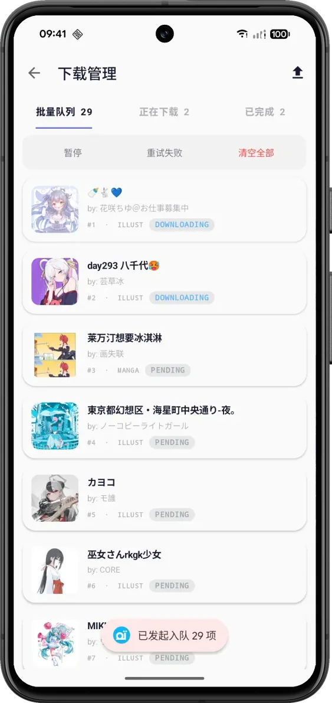<br><b>Downloads</b><br><sub>Batch download · queue management</sub><br><sub>Batch queue · Resumable · Caption export · Batch rename · aria2 remote</sub></td>
<td align="center">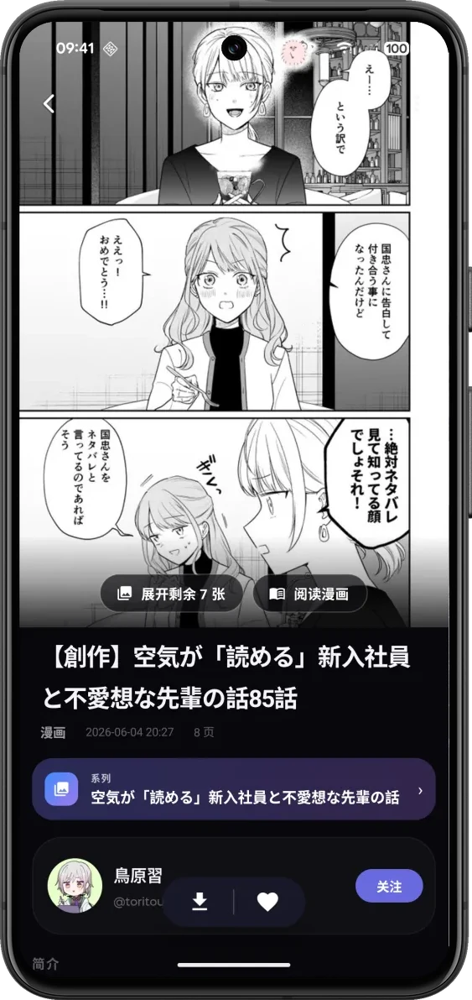<br><b>Manga</b><br><sub>Serialised manga, chapter by chapter</sub><br><sub>Follow series · Read whole chapters · Batch download / bookmark</sub></td>
</tr>
<tr>
<td align="center">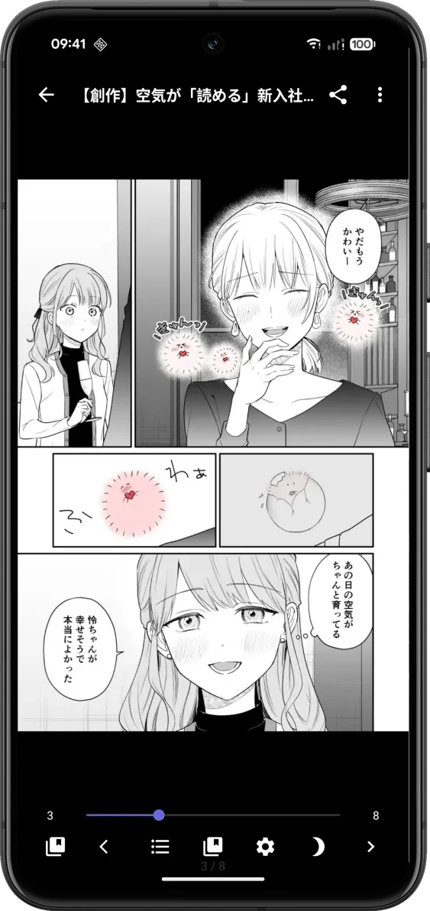<br><b>Manga reader</b><br><sub>Turns like paper, immersive</sub><br><sub>Two-way paging · Bookmarks · Translate the whole series · Night mode</sub></td>
<td align="center">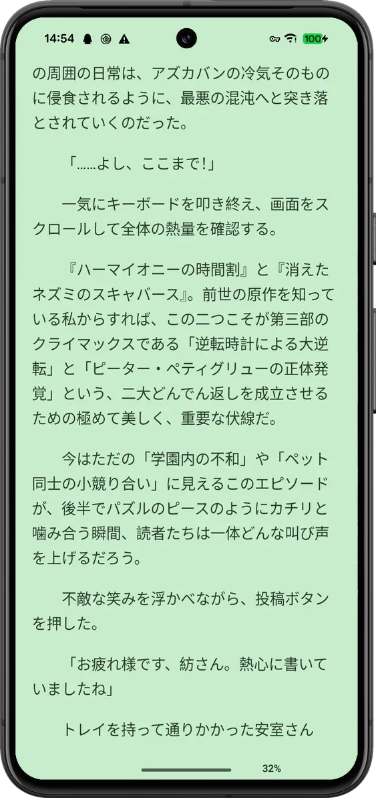<br><b>Novel reader</b><br><sub>Immersive reading</sub><br><sub>Progress percentage · Auto-mixed illustrations · Local txt library</sub></td>
<td></td>
</tr>
</table>

<details>
<summary><b>More about each screen</b></summary>
<br>

- **Home** — rankings preview in a horizontal strip, a personalised waterfall feed, bookmark straight from the card, long-press for the action menu. On a tablet in landscape you can turn on two-pane: list on the left, detail on the right.
- **Viewer** — ZoomImage engine for silky zooming, three double-tap behaviours to choose from, force-load the original at any time. Multi-page works fold into one and expand with a tap or open in the reader; download, bookmark and comments sit in a floating capsule, with reverse image search and AI upscaling on the same screen.
- **Search** — switch between six sort orders with one tap: popularity preview, newest, oldest, popular, popular (male), popular (female). Stack on search scope, type, upload period, bookmark-count range, aspect ratio and resolution, plus a three-way AI switch (any / hide / only) — sorting by popularity needs no Pixiv Premium.
- **Artist** — follow artists you like and see their illustrations, manga, novels, manga series and bookmarks at a glance; the advanced tag search panel digs through all of that artist's tags, and the profile can be pinned to your home screen.
- **Discover** — manga and novel columns on top, then official PixiVision features, live trending tags and newest uploads; further down, bookmark charts, AI charts, charts by era, wallpaper charts, tag zones and artist charts — good work always surfaces.
- **Trending tags** — Original, VTuber, Genshin, Wuthering Waves, Blue Archive… trending tags refreshed in real time with cover previews.
- **Downloads** — queue a whole set, with downloading / waiting / done sections; resume from where the connection dropped, batch-rename with naming templates, export captions alongside, or send jobs straight to aria2 on your NAS.
- **Manga** — series shown chapter by chapter; follow the author to never miss an update. Open to read, batch download a whole set, and bookmark / un-bookmark while multi-selecting.
- **Manga reader** — previous / next chapter flow, paging direction, progress bar, table of contents, bookmarks and night mode; "translate the whole series" keeps running in the background after you leave the viewer.
- **Novel reader** — series, contents, night mode, font size / line spacing / background to taste, an always-on progress percentage at the bottom, and related illustrations mixed in automatically. Pick a folder to read local txt; bookmarking saves the whole TXT.

</details>

## 🤖 AI

### AI on board, one level up
Generative AI in your pocket — sharper images, manga you can read, characters cut out in a tap, smoother ugoira.

<table>
<tr>
<td width="50%" valign="top">

#### 🔍 Super-resolution upscaling
AI super-resolution enlarges low-res illustrations 2–4×, rebuilding hair strands and line detail so thumbnails and old images come back in HD.
- 2× / 4× smart upscaling
- Line-art sharpening · denoise
- On-device inference · nothing uploaded

#### ✂️ Smart cut-out
Separate character from background in one tap, with edges clean down to single hairs, and export a transparent PNG — avatars, stickers and fan-art material ready to go.
- Hair-level edges
- Transparent PNG export
- Batch processing

</td>
<td width="50%" valign="top">

#### 💬 Manga translation (OCR + MT)
Detects speech bubbles automatically, translates in place and re-typesets; "translate the whole series" finishes multiple pages in one go and keeps running after you leave the viewer. Besides the built-in engine you can plug in your own OpenAI-compatible endpoint.
- Automatic bubble detection
- Translate whole series · runs in background
- Custom AI endpoint · streaming

#### 🎞️ Ugoira frame interpolation (RIFE)
RIFE interpolation adaptively brings ugoira up to 2× / 4×, close to the 50 fps ceiling; playback uses a frame-sequence player so motion no longer depends on the device.
- Adaptive 2× / 4×
- Save as H.264 MP4
- A fraction of the size of a GIF

</td>
</tr>
</table>

<sub>AI features keep evolving — more coming.</sub>

## 🛠️ Under the hood

<div align="center">
  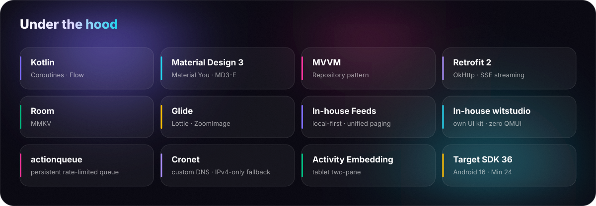
</div>

A modern Android stack, Kotlin-first, with a clear architecture and an eye on performance and battery. See the module docs for the in-house pieces: [feeds](./docs/feeds-module.md) · [actionqueue](./docs/action-queue.md) · [direct connect](./docs/direct-connect.md) · [image host](./docs/image-host.md).

### Building from source

```bash
git clone https://github.com/CeuiLiSA/Pixiv-Shaft.git
cd Pixiv-Shaft

./gradlew assembleDebug      # debug APK
./gradlew assembleRelease    # release APK (needs a signing config)
```

**Requirements:** JDK 17+, Android SDK 36 · Min SDK 24 (Android 7.0), Target SDK 36 (Android 16)

## 💎 Plans

Shaft itself is free, open source and ad-free forever, with every feature unlocked — including AI upscaling, cut-out, manga translation and ugoira interpolation. The one thing with a quota is **"sort any keyword by popularity"**, because it uses shared search resources. Subscribing only multiplies that quota; it never unlocks exclusive features.

| | Free | Pro | Max |
|---|---|---|---|
| Popularity-sort quota | 1× | 5× | 20× |
| All illustration / manga / novel / ranking features | ✅ | ✅ | ✅ |
| AI upscaling, cut-out, translation, interpolation | ✅ | ✅ | ✅ |
| Sort any keyword by popularity | basic quota, then falls back to popularity preview | ✅ | ✅ |
| Auto-renew | — | no, falls back to Free on expiry | no, falls back to Free on expiry |

Already a pixiv Premium member? Popularity sort goes straight through the official API — unlimited, no subscription needed. The in-app **Usage** page shows remaining quota and lets you order directly; orders placed on Afdian can be claimed with "Restore purchase". Prices and details: [pixshaft.com](https://pixshaft.com/#pricing) · [afdian.com/a/pixshaft](https://afdian.com/a/pixshaft).

## ❓ FAQ

<details><summary><b>Are PixShaft and Shaft the same app?</b></summary><br>Yes. PixShaft is the public name on Google Play and at pixshaft.com; the project codename is Shaft (repository <code>Pixiv-Shaft</code>). Same open-source code, same team — look for pixshaft.com.</details>
<details><summary><b>Is PixShaft an official app?</b></summary><br>No. PixShaft (Shaft) is an unofficial third-party Pixiv client, open-sourced for learning and communication only. All illustrations, manga and novels are copyrighted by their creators or Pixiv.</details>
<details><summary><b>Do I have to pay, or have Premium?</b></summary><br>The app is completely free, open source and ad-free, with nothing locked — including AI upscaling, cut-out, manga translation and ugoira interpolation. The only quota is on "sort any keyword by popularity" (it uses shared search resources): free users get a base quota and fall back to popularity preview when it runs out, or you can turn off default popularity sorting in Settings and keep the quota for when you need it. For more quota, subscribe to Pro (5×) or Max (20×); pixiv Premium members go straight through the official API with no limit and no subscription.</details>
<details><summary><b>Does direct connection work in mainland China?</b></summary><br>Yes. Shaft ships with a direct-connection scheme, so mainland users can browse without an extra proxy. If it won't connect, open the built-in network test page — DNS, App API, web endpoints and a real image download are checked one by one and IPv6 pollution is called out; slow images can be switched to pixiv.cat / pixiv.re / pixiv.nl or your own reverse proxy, and you can also fill in your own App API proxy.</details>
<details><summary><b>If a download breaks halfway, is it wasted?</b></summary><br>No. Downloads are resumable — retries and cold starts continue from the last progress. There's also batch rename, naming-template organisation, automatic caption export, "low-key download" (downloaded images don't crowd the front of your gallery or WeChat / QQ pickers), and remote download to aria2 on your NAS.</details>
<details><summary><b>Tablet support?</b></summary><br>Yes. In landscape you can enable two-pane mode: the feed in the left third, the artwork detail in the right two-thirds — tap and it opens on the right, no backing out. It's a switch; turn it off any time.</details>
<details><summary><b>Which Android versions?</b></summary><br>Android 7.0 and up (Min SDK 24), targeting Android 16 (Target SDK 36).</details>
<details><summary><b>Where do I download it?</b></summary><br>Install from <a href="https://play.google.com/store/apps/details?id=ceui.pixiv.pshaft">Google Play</a>, or grab the latest APK from <a href="https://github.com/CeuiLiSA/Pixiv-Shaft/releases/latest">GitHub Releases</a>. It's fully open source — build it yourself if you like.</details>

More in the [FAQ](./FAQ.md) · [install FAQ](./FAQ-install.md) · [download path & filename guide](./DOWNLOAD.md).

## 🤝 Contributing

Contributions are welcome! Feel free to open issues or submit pull requests.

For V3 UI work, start with the [V3 design philosophy](docs/v3-design-philosophy.md), [component gallery](mockup/v3-design-system/index.html), and [page starter](mockup/v3-design-system/starter.html).

### 🏆 Top Contributors

<table>
  <tr>
    <td align="center"><a href="https://github.com/CeuiLiSA"><br/><sub><b>🥇 CeuiLiSA</b></sub></a><br/><sub>521 commits</sub><br/><sub>+143,913 / −85,914</sub></td>
    <td align="center"><a href="https://github.com/sunbeams001"><br/><sub><b>🥈 sunbeams001</b></sub></a><br/><sub>504 commits</sub><br/><sub>+21,001 / −9,963</sub></td>
    <td align="center"><a href="https://github.com/SoxiaLiSA"><br/><sub><b>🥉 SoxiaLiSA</b></sub></a><br/><sub>332 commits</sub><br/><sub>+52,639 / −15,211</sub></td>
    <td align="center"><a href="https://github.com/4ragaki"><br/><sub><b>4ragaki</b></sub></a><br/><sub>41 commits</sub><br/><sub>+1,231 / −201</sub></td>
    <td align="center"><a href="https://github.com/duzhaokun123"><br/><sub><b>duzhaokun123</b></sub></a><br/><sub>37 commits</sub><br/><sub>+1,174 / −717</sub></td>
  </tr>
  <tr>
    <td align="center"><a href="https://github.com/0-a-e"><br/><sub><b>0-a-e</b></sub></a><br/><sub>19 commits</sub><br/><sub>+907 / −839</sub></td>
    <td align="center"><a href="https://github.com/Lostin-Tianyi"><br/><sub><b>Lostin-Tianyi</b></sub></a><br/><sub>17 commits</sub><br/><sub>+1,080 / −149</sub></td>
    <td align="center"><a href="https://github.com/SodaWithoutSparkles"><br/><sub><b>SodaWithoutSparkles</b></sub></a><br/><sub>16 commits</sub><br/><sub>+351 / −273</sub></td>
    <td align="center"><a href="https://github.com/LoxiaLiSA"><br/><sub><b>LoxiaLiSA</b></sub></a><br/><sub>14 commits</sub><br/><sub>+50,536 / −15,637</sub></td>
    <td align="center"><a href="https://github.com/yxsra"><br/><sub><b>yxsra</b></sub></a><br/><sub>11 commits</sub><br/><sub>+182 / −53</sub></td>
  </tr>
</table>

<sub>Commits from the GitHub contributors API; lines added / removed from <code>git log --numstat</code>. Snapshot taken 2026-04-21 — see the [live list](https://github.com/CeuiLiSA/Pixiv-Shaft/graphs/contributors).</sub>

### All contributors

<a href="https://github.com/CeuiLiSA/Pixiv-Shaft/graphs/contributors">
  
</a>

<br>

[](https://star-history.dera.page/#CeuiLiSA/Pixiv-Shaft&type=Date)

## 💗 Support the Project

Shaft is free and open-source, built and maintained in spare time. If it has been
useful to you, you can support continued development on **Afdian (爱发电)**:

<div align="center">

### 💗 [afdian.com/a/pixshaft](https://afdian.com/a/pixshaft)

[](https://afdian.com/a/pixshaft)

</div>

Sponsorship is entirely optional — every feature of Shaft is, and will stay, free for
everyone. Starring the repo, reporting bugs, and sending pull requests help just as much.

## 📄 License

Pixiv-Shaft is licensed under the [GNU General Public License, version 2](./LICENSE).

The Telegram Android `SpoilerEffect2` renderer and shaders are derived from the official Telegram Android source; see [third-party notices](./THIRD_PARTY_NOTICES.md).

---

<div align="center">

<a href="https://github.com/CeuiLiSA/Pixiv-Shaft/releases/latest">
  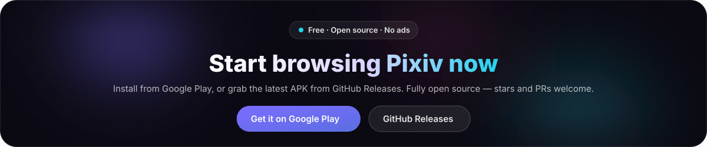
</a>

<br><br>

**If you find Shaft useful, consider giving it a star!**

[](https://github.com/CeuiLiSA/Pixiv-Shaft)
&nbsp;
[](https://afdian.com/a/pixshaft)

<sub>The README assets (hero, chips, framed screenshots) are generated by <a href="./scripts/build_readme_assets.py"><code>scripts/build_readme_assets.py</code></a> from the real-device screenshots in <code>snap/pixshaft/screens</code>.</sub>

Made with love for the Pixiv community

</div>
