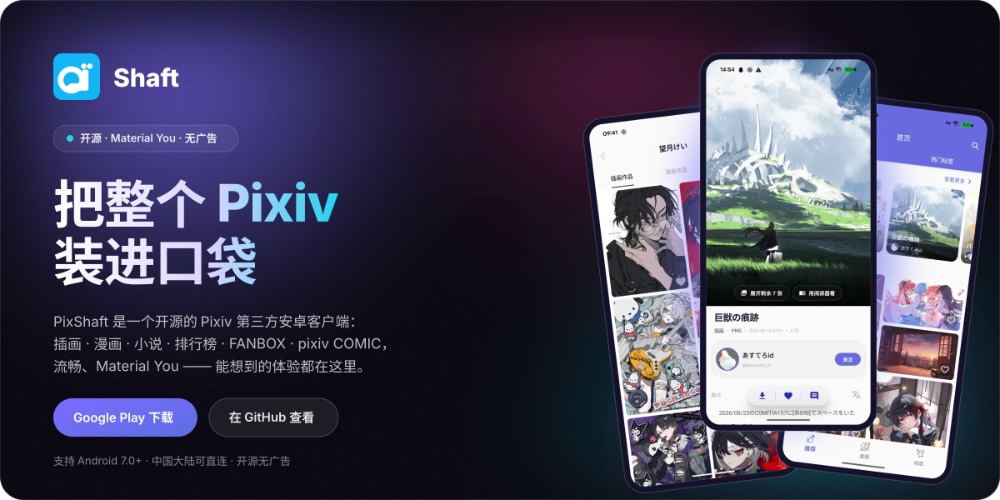
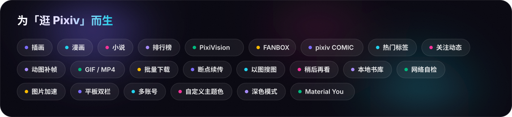
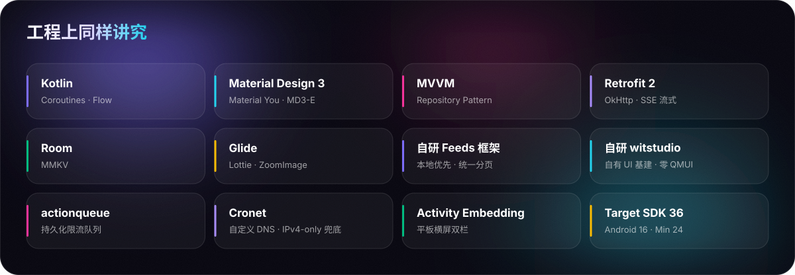

<div align="center">

<a href="https://pixshaft.com" title="pixshaft.com — Shaft 官网">
  
</a>

<br>

[](https://github.com/CeuiLiSA/Pixiv-Shaft/stargazers)
[](https://github.com/CeuiLiSA/Pixiv-Shaft/network/members)
[](https://github.com/CeuiLiSA/Pixiv-Shaft/releases/latest)
[](../LICENSE)

[](https://github.com/CeuiLiSA/Pixiv-Shaft/actions)
[](https://github.com/CeuiLiSA/Pixiv-Shaft/issues)
[](https://github.com/CeuiLiSA/Pixiv-Shaft/issues?q=is%3Aissue+is%3Aclosed)
[](https://github.com/CeuiLiSA/Pixiv-Shaft/commits)
[](https://github.com/CeuiLiSA/Pixiv-Shaft)
[](https://github.com/CeuiLiSA/Pixiv-Shaft)
[](https://github.com/CeuiLiSA/Pixiv-Shaft/graphs/contributors)
[](https://github.com/CeuiLiSA/Pixiv-Shaft/releases)

**PixShaft（Shaft）** 是一个开源的 Pixiv 第三方安卓客户端：插画 · 漫画 · 小说 · 排行榜 · FANBOX · pixiv COMIC，流畅、Material You —— 能想到的体验都在这里。

[](https://play.google.com/store/apps/details?id=ceui.pixiv.pshaft)
&nbsp;&nbsp;
[](https://github.com/CeuiLiSA/Pixiv-Shaft/releases/latest)
&nbsp;&nbsp;
[](https://pixshaft.com)
&nbsp;&nbsp;
[](https://afdian.com/a/pixshaft)

<sub>支持 Android 7.0+ · 中国大陆可直连 · 开源无广告</sub>

---

[English](../README.md) | **简体中文** | [日本語](./README.ja.md)

</div>

> [!NOTE]
> 本应用是 [Pixiv](https://www.pixiv.net) 的非官方第三方客户端。所有插画、漫画、小说作品版权归各自创作者或 Pixiv 所有。本项目开源仅用于学习与交流。

<br>

<div align="center">
  
</div>

## ✨ 特性

### 一个能打的 Pixiv 客户端
从浏览发现到下载收藏，从 FANBOX 到 pixiv COMIC —— 把你在 Pixiv 想做的事都做到极致。

<table>
<tr>
<td width="50%" valign="top">

#### 🎯 为你而生的推荐流
插画、漫画、小说个性化推荐，热门标签实时更新，每次下拉都是新惊喜。

#### 🏆 排行榜与榜单专区
日 / 周 / 月榜带日期选择器，回看任意一天；发现页还有收藏榜、AI 榜、年代榜、壁纸榜、标签专区与画师榜。

#### 🔍 强大的搜索与筛选
六档排序、投稿期间、喜欢数区间、长宽比与分辨率，AI 作品三档切换 —— 按热度排序**无需** Pixiv 高级会员。

#### 🖼️ 以图搜图
SauceNAO / TinEye / IQDB / Ascii2D 一键溯源。

#### 🎁 FANBOX 与 pixiv COMIC
原生 FANBOX：投稿流、推荐创作者、帖子正文与赞助方案，不再只是丢给浏览器；pixiv COMIC 首页也直接进 App，一个账号全都通。

#### 📖 小说阅读器 · 本地书库
系列、章节、书签、进度百分比一应俱全，还能自动混排插画；选个文件夹就能读本地 txt，收藏即存整篇 TXT。

</td>
<td width="50%" valign="top">

#### 👥 多账号快速切换
关注、私信、收藏，多个账号自由穿梭。

#### ⬇️ 批量下载 · 断点续传
整组作品一次入队，网络抖动断了从断点接着下；可按命名模板批量重命名、连简介一起导出，也能把任务甩给 NAS 上的 aria2。

#### 🙈 屏蔽设定
按标签、按作者分别管理，单个作品也能就地屏蔽 —— 卡片打码后一点即可揭开。

#### 🔖 稍后再看
长按卡片先收进来，纯本地不上报，攒一波再慢慢看。

#### 📡 网络自检 · 直连不折腾
内置网络测试页：DNS、App API、网页端点与真实图片下载逐项体检，IPv6 污染当场点名。慢就换 pixiv.cat / pixiv.re / pixiv.nl 或自建反代，也可以走自己的 App API 代理。

#### ⚡ 冷启秒开 · 本地优先
自研列表框架：首页推荐、排行榜、最新作品打开先秒显上次的快照，网络在后台悄悄刷新；收藏与关注还会进持久化队列，断网点了也不会丢。

</td>
</tr>
</table>

## 📱 界面

### 每一屏，都打磨到位
真机实拍 —— 你在这里看到的，就是你打开 App 时用到的。

<table>
<tr>
<td align="center" width="33%"><br><b>首页</b><br><sub>推荐与排行，一屏直达</sub><br><sub>个性化推荐 · 排行榜横滑 · 卡片一键收藏</sub></td>
<td align="center" width="33%"><br><b>看图</b><br><sub>高清看图，细节毕现</sub><br><sub>多 P 折叠 · 下载 / 收藏 / 评论胶囊 · 加载原图 · 以图搜图</sub></td>
<td align="center" width="33%"><br><b>搜索</b><br><sub>想看的，精准筛出来</sub><br><sub>六档排序 · 喜欢数区间 · AI 三档 · 仅安全</sub></td>
</tr>
<tr>
<td align="center"><br><b>画师</b><br><sub>走进画师的世界</sub><br><sub>标签高级搜索 · 作品 / 收藏导航 · 添加到桌面</sub></td>
<td align="center"><br><b>作品墙</b><br><sub>插画、漫画、小说分栏浏览</sub><br><sub>瀑布流 · 卡片收藏 · 漫画系列</sub></td>
<td align="center"><br><b>发现</b><br><sub>特辑、专栏与榜单专区</sub><br><sub>漫画 / 小说专栏 · PixiVision 特辑 · 热度标签 · 榜单专区</sub></td>
</tr>
<tr>
<td align="center"><br><b>热门标签</b><br><sub>实时热门，紧跟潮流</sub><br><sub>实时热门标签 · 封面预览 · 一键进入</sub></td>
<td align="center"><br><b>下载</b><br><sub>批量下载 · 队列管理</sub><br><sub>批量队列 · 断点续传 · 简介导出 · 批量重命名 · aria2 远程</sub></td>
<td align="center"><br><b>漫画</b><br><sub>漫画连载，逐话追更</sub><br><sub>系列追更 · 整话阅读 · 批量下载 / 收藏</sub></td>
</tr>
<tr>
<td align="center"><br><b>漫画阅读</b><br><sub>翻页如纸，沉浸看番</sub><br><sub>双向翻页 · 书签 · 翻译整部漫画 · 夜间模式</sub></td>
<td align="center"><br><b>小说</b><br><sub>沉浸式小说阅读器</sub><br><sub>常驻进度百分比 · 自动混排插画 · 本地 txt 书库</sub></td>
<td></td>
</tr>
</table>

<details>
<summary><b>每一屏的更多说明</b></summary>
<br>

- **首页** —— 排行榜横滑预览，为你推荐瀑布流，卡片上直接收藏、长按出操作菜单。一打开就能刷到喜欢的画师与作品；平板横屏还能开双栏，左边列表右边详情。
- **看图** —— ZoomImage 引擎丝滑缩放，双击缩放行为三选一，随手还能强制加载原图。多 P 作品折叠成一张，一键展开或丢进阅读器连着看；下载、收藏、评论收进悬浮胶囊，以图搜图与 AI 画质增强也在同一屏。
- **搜索** —— 排序六档一点即换：热度预览、从新到旧、从旧到新、按热度、男性向热度、女性向热度。再叠上检索范围、作品类别、投稿期间、喜欢数区间、长宽比与分辨率，AI 作品三档切换（不限 / 屏蔽 / 只看）—— 按热度排序无需 Pixiv 高级会员。
- **画师** —— 关注喜欢的画师，插画、漫画、小说、漫画系列与收藏一目了然；标签高级搜索面板可以在这位画师的全部标签里翻找，还能把主页钉到桌面。
- **发现** —— 漫画与小说专栏摆在最上面，接着是官方 PixiVision 特辑、实时热度标签和最新投稿；再往下还有收藏榜、AI 榜、年代榜、壁纸榜、标签专区和画师榜，好作品总能被翻出来。
- **热门标签** —— 原创、VTuber、原神、鸣潮、BlueArchive…… 热门标签实时更新，带封面预览，一眼锁定当下流行。
- **下载** —— 整组作品一次入队，下载中 / 等待 / 已完成分区清晰；断线从断点续传，命名模板可批量改名、连作品简介一起导出，也能直接发到 NAS 上的 aria2。
- **漫画** —— 系列漫画整话呈现，关注作者即可追更不漏。点开即读，还能批量下载整组保存，批量选择时顺手收藏或取消收藏。
- **漫画阅读** —— 上一话 / 下一话流畅切换，翻页方向、进度条、目录、书签、夜间模式齐备；一键「翻译整部」，退出看图页也在后台继续翻。
- **小说** —— 系列、目录、夜间模式，字号行距与背景随心调，底部常驻进度百分比；还能自动混排相关插画。选个文件夹就能读本地 txt，收藏即存整篇 TXT。

</details>

## 🤖 AI 能力

### AI 加持，体验再进一阶
把生成式 AI 装进口袋 —— 让每张图更清晰、每话漫画看得懂、每个角色随手抠出、每张动图更顺滑。

<table>
<tr>
<td width="50%" valign="top">

#### 🔍 超分辨率画质增强
AI 超分将低清插画放大 2–4 倍，重建发丝与线条细节，缩略图、老图也能还原高清。
- 2× / 4× 智能放大
- 线稿锐化 · 降噪
- 本地推理 · 不上传

#### ✂️ 智能抠图
一键分离角色与背景，边缘干净到发丝级，导出透明 PNG，做头像、表情包、二创素材即取即用。
- 发丝级边缘
- 透明 PNG 导出
- 支持批量处理

</td>
<td width="50%" valign="top">

#### 💬 翻译漫画（OCR + 翻译）
自动识别画框里的对话气泡，原位翻译并回填嵌字；「翻译整部」一键翻完多页，退出看图页仍在后台跑。除内置引擎外，还能填自己的 OpenAI 兼容接口。
- 气泡自动检测
- 翻译整部 · 后台继续
- 自定义 AI 接口 · 流式

#### 🎞️ 动图 AI 补帧（RIFE）
RIFE 补帧把 Ugoira 动图自适应插到 2× / 4×，贴近 50fps 上限；播放走帧序列播放器，动作速率不再看设备脸色。
- 自适应 2× / 4×
- 可存成 H.264 MP4
- 体积仅 GIF 的十几分之一

</td>
</tr>
</table>

<sub>AI 功能持续进化中 · 更多能力陆续上线</sub>

## 🛠️ 技术

<div align="center">
  
</div>

现代 Android 技术栈，Kotlin 优先，架构清晰，性能与电量友好。自研模块的说明见：[feeds](../docs/feeds-module.md) · [actionqueue](../docs/action-queue.md) · [直连](../docs/direct-connect.md) · [图片源](../docs/image-host.md)。

### 从源码构建

```bash
git clone https://github.com/CeuiLiSA/Pixiv-Shaft.git
cd Pixiv-Shaft

./gradlew assembleDebug      # debug APK
./gradlew assembleRelease    # release APK（需要签名配置）
```

**要求：** JDK 17+、Android SDK 36 · 最低 Android 7.0（Min SDK 24），目标 Android 16（Target SDK 36）

## 💎 订阅

Shaft 本体永远免费、开源、无广告，全部功能不上锁 —— 包括 AI 超分、抠图、漫画翻译与动图补帧。只有「任意关键字按热度排序」这一项要占用公共搜索资源，才做了额度 —— 订阅只是把额度加倍，不解锁任何独占功能。

| | Free | Pro | Max |
|---|---|---|---|
| 热度排序额度 | 1× | 5× | 20× |
| 插画 / 漫画 / 小说 / 排行榜全部功能 | ✅ | ✅ | ✅ |
| AI 超分、抠图、翻译与动图补帧 | ✅ | ✅ | ✅ |
| 任意关键字按热度排序 | 基础额度，用完自动降为热度预览 | ✅ | ✅ |
| 自动续费 | — | 否，到期自动回到免费档 | 否，到期自动回到免费档 |

已经是 pixiv Premium 会员？热度排序直接走官方接口，不限次数，也不用订阅。App 内「使用情况」页可以随时查看剩余额度并直接下单，付完自动到账；在爱发电站外下单的，用订单号「恢复购买」即可认领。价格与详情见 [pixshaft.com](https://pixshaft.com/#pricing) · [afdian.com/a/pixshaft](https://afdian.com/a/pixshaft)。

## ❓ 常见问题

<details><summary><b>PixShaft 和 Shaft 是同一个应用吗？</b></summary><br>是的。PixShaft 是本应用在 Google Play 与官网 pixshaft.com 上的对外名称，项目代号 Shaft（开源仓库名 <code>Pixiv-Shaft</code>）。同一套开源代码、同一个团队维护，认准 pixshaft.com 即可。</details>
<details><summary><b>PixShaft 是官方应用吗？</b></summary><br>不是。PixShaft（Shaft）是一个非官方的第三方 Pixiv 客户端，开源仅用于学习与交流。所有插画、漫画、小说作品版权归各自创作者或 Pixiv 所有。</details>
<details><summary><b>需要付费或会员吗？</b></summary><br>App 本身完全免费、开源、无广告，所有功能都不上锁 —— 包括 AI 超分、抠图、漫画翻译与动图补帧。唯一有额度的是「任意关键字按热度排序」（它要占用公共搜索资源）：免费用户有基础额度，用完会自动降为热度预览，也可以在设置里关掉默认热度排序，把额度留到真正需要的时候。想要更多额度可以订阅 Pro（5× 额度）或 Max（20× 额度）；已经是 pixiv Premium 会员的话直接走官方接口，不限次数，也不用订阅。</details>
<details><summary><b>中国大陆能直连吗？</b></summary><br>支持。Shaft 内置直连方案，大陆用户无需额外代理即可正常浏览。连不上时可以打开内置的网络测试页，DNS、App API、网页端点与真实图片下载会逐项体检，IPv6 污染会被当场点名；图片加载慢还能把图片源切到 pixiv.cat / pixiv.re / pixiv.nl 或自建反代，也可以填自己的 App API 代理。</details>
<details><summary><b>下载到一半断了会白下吗？</b></summary><br>不会。下载支持断点续传，重试和冷启动都能接着上次的进度下完。此外还有批量重命名、按命名模板整理、下载时自动导出作品简介、「低调下载」（下载的图不会挤在相册和微信 / QQ 选图的「最近」前排），以及把任务直接发给 NAS 上 aria2 的远程下载。</details>
<details><summary><b>支持平板吗？</b></summary><br>支持。平板横屏可以开启双栏模式，左侧 1/3 是信息流、右侧 2/3 是作品详情，点一下就在右边展开，不用来回退出；这是个可关的开关，不喜欢随时改回单栏。</details>
<details><summary><b>支持哪些 Android 版本？</b></summary><br>最低支持 Android 7.0（Min SDK 24），目标 Android 16（Target SDK 36），覆盖绝大多数在用设备。</details>
<details><summary><b>在哪里下载？</b></summary><br>可在 <a href="https://play.google.com/store/apps/details?id=ceui.pixiv.pshaft">Google Play</a> 安装，或前往 <a href="https://github.com/CeuiLiSA/Pixiv-Shaft/releases/latest">GitHub Releases</a> 下载最新 APK。项目完全开源，欢迎自行构建。</details>

更多见 [FAQ](../FAQ.md) · [安装 FAQ](../FAQ-install.md) · [下载路径与文件名指南](../DOWNLOAD.md)。

## 🤝 参与贡献

欢迎提 issue 和 pull request！

设计或实现 V3 页面前，先读 [V3 设计哲学](../docs/v3-design-philosophy.md)，再看 [组件图鉴](../mockup/v3-design-system/index.html) 和 [页面模板](../mockup/v3-design-system/starter.html)。

### 🏆 主要贡献者

<table>
  <tr>
    <td align="center"><a href="https://github.com/CeuiLiSA"><br/><sub><b>🥇 CeuiLiSA</b></sub></a><br/><sub>521 commits</sub><br/><sub>+143,913 / −85,914</sub></td>
    <td align="center"><a href="https://github.com/sunbeams001"><br/><sub><b>🥈 sunbeams001</b></sub></a><br/><sub>504 commits</sub><br/><sub>+21,001 / −9,963</sub></td>
    <td align="center"><a href="https://github.com/SoxiaLiSA"><br/><sub><b>🥉 SoxiaLiSA</b></sub></a><br/><sub>332 commits</sub><br/><sub>+52,639 / −15,211</sub></td>
    <td align="center"><a href="https://github.com/4ragaki"><br/><sub><b>4ragaki</b></sub></a><br/><sub>41 commits</sub><br/><sub>+1,231 / −201</sub></td>
    <td align="center"><a href="https://github.com/duzhaokun123"><br/><sub><b>duzhaokun123</b></sub></a><br/><sub>37 commits</sub><br/><sub>+1,174 / −717</sub></td>
  </tr>
  <tr>
    <td align="center"><a href="https://github.com/0-a-e"><br/><sub><b>0-a-e</b></sub></a><br/><sub>19 commits</sub><br/><sub>+907 / −839</sub></td>
    <td align="center"><a href="https://github.com/Lostin-Tianyi"><br/><sub><b>Lostin-Tianyi</b></sub></a><br/><sub>17 commits</sub><br/><sub>+1,080 / −149</sub></td>
    <td align="center"><a href="https://github.com/SodaWithoutSparkles"><br/><sub><b>SodaWithoutSparkles</b></sub></a><br/><sub>16 commits</sub><br/><sub>+351 / −273</sub></td>
    <td align="center"><a href="https://github.com/LoxiaLiSA"><br/><sub><b>LoxiaLiSA</b></sub></a><br/><sub>14 commits</sub><br/><sub>+50,536 / −15,637</sub></td>
    <td align="center"><a href="https://github.com/yxsra"><br/><sub><b>yxsra</b></sub></a><br/><sub>11 commits</sub><br/><sub>+182 / −53</sub></td>
  </tr>
</table>

<sub>提交数来自 GitHub contributors API；增删行数来自 <code>git log --numstat</code>。快照于 2026-04-21 —— 实时列表见 [这里](https://github.com/CeuiLiSA/Pixiv-Shaft/graphs/contributors)。</sub>

### 全部贡献者

<a href="https://github.com/CeuiLiSA/Pixiv-Shaft/graphs/contributors">
  
</a>

<br>

[](https://star-history.dera.page/#CeuiLiSA/Pixiv-Shaft&type=Date)

## 💗 支持项目

Shaft 免费开源，由业余时间开发维护。如果它对你有用，欢迎在 **爱发电** 支持持续开发：

<div align="center">

### 💗 [afdian.com/a/pixshaft](https://afdian.com/a/pixshaft)

[](https://afdian.com/a/pixshaft)

</div>

赞助完全自愿 —— Shaft 的每一项功能现在和将来都对所有人免费。点个 Star、报个 bug、提个 PR，同样是莫大的帮助。

## 📄 许可证

Pixiv-Shaft 基于 [GNU General Public License, version 2](../LICENSE) 开源。

Telegram Android 的 `SpoilerEffect2` 渲染器与着色器派生自 Telegram Android 官方源码；见 [第三方声明](../THIRD_PARTY_NOTICES.md)。

---

<div align="center">

<a href="https://github.com/CeuiLiSA/Pixiv-Shaft/releases/latest">
  
</a>

<br><br>

**觉得 Shaft 好用？给个 Star 吧！**

[](https://github.com/CeuiLiSA/Pixiv-Shaft)
&nbsp;
[](https://afdian.com/a/pixshaft)

<sub>README 里的 hero、chips、带边框截图等素材由 <a href="../scripts/build_readme_assets.py"><code>scripts/build_readme_assets.py</code></a> 从 <code>snap/pixshaft/screens</code> 的真机截图生成。</sub>

Made with love for the Pixiv community

</div>
