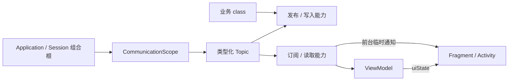

# 通用 Kotlin 通信系统

已实现第一版：`:communication` 纯 Kotlin/JVM 内核、`app` 内的生命周期扩展，
并接入 app 的 `ServicesProvider.communicationScope`。内核不依赖 Android、Room、OkHttp
或业务模型。持久化 Inbox 是后续扩展，当前不提供跨进程补投与处理确认。

## 1. 三种通信语义

| 能力 | 职责 | 晚订阅 |
|---|---|---|
| `EventTopic<E>` | 广播“发生了什么”，如下载完成提示、收藏操作通知 | 不补发历史 |
| `StateSource<K, S>` / `StateTopic<K, S>` | 观察“这个对象现在是什么状态” | 得到对应 key 的当前快照 |
| DurableInbox（尚未实现） | 必须最终处理的消息、认领、确认、重试 | 从持久化存储补投 |

事件与状态各有用途。下载完成事件可以用于前台提示，按钮则观察下载状态。页面错过
完成事件后，仍能从 Repository / StateSource 恢复正确按钮。收藏、登录、连接态、缓存
等领域使用同一套基础接口，自行定义消息和状态类型。



## 2. 模块与入口

- [communication](../communication/src/main/kotlin/ceui/pixiv/communication)：API、作用域、事件邮箱、按 key 的状态存储。
- [LifecycleSubscriptions](../app/src/main/java/ceui/pixiv/communication/android/LifecycleSubscriptions.kt)：`collectIn` 扩展。
- [ServicesProvider](../app/src/main/java/ceui/pixiv/services/ServiceProvider.kt)：app 的进程容器访问入口，实例由 `Shaft` 持有。
- [下载业务接入设计](download-state-integration.md)：下载领域的后续迁移设计；现有下载广播、轮询尚未迁移。

借鉴 actionqueue 的依赖隔离、普通可注入类，以及 websocket 的读写接口分离、关闭、
背压和旧会话防护。不同业务在组合根创建不同 topic，不需要维护全 app 的巨大事件枚举。

## 3. 创建一次，按能力注入

```kotlin
import ceui.pixiv.communication.*

sealed interface DownloadNotice {
    data class Completed(val artworkId: Long, val page: Int) : DownloadNotice
}

// 在业务组合根创建一次，而不是每个 Fragment 各建一个。
val topic = communicationScope.eventTopic<DownloadNotice>(
    EventTopicConfig(
        debugName = "download-notices",
        bufferCapacity = 64,
        maxSubscribers = 32,
        overflow = OverflowPolicy.RejectNew,
    ),
)

// 执行类只拿发布能力；消费方只拿读取能力。
val publisher: EventPublisher<DownloadNotice> = topic.publisher
val source: EventSource<DownloadNotice> = topic.source
```

Topic 实例就是身份。debugName 仅用于诊断，同名 topic 不会合并；不使用字符串寻址、
反射注册或全局 Any 强转。状态按有类型的 key 路由；事件按对象筛选可在业务侧派生
`source.events.filter { ... }`。不要为每个作品永久创建一个 topic。

app 使用已有 `Context.appServices().communicationScope` 获取组合根容器。登录模块
需要会话隔离时自行创建 `CommunicationScope()`，退出时 close；旧发布句柄不能写入
下一次会话的新 topic。核心服务没有 Kotlin object 全局可变状态。

## 4. 发布与背压

```kotlin
when (publisher.tryPublish(DownloadNotice.Completed(42, 0))) {
    PublishResult.Accepted -> Unit
    PublishResult.RejectedFull -> recordDroppedForegroundHint()
    PublishResult.Closed -> Unit // 所属会话已经结束
}
```

`recordDroppedForegroundHint` 是业务侧诊断示意。丢失一个允许丢失的提示不能回滚已经
提交的文件；需要“完成后必须执行”的处理，应提交持久化任务。

| 策略 | `publish` | `tryPublish` |
|---|---|---|
| Suspend | 容量不足则挂起，可取消 | 容量不足返回 RejectedFull |
| RejectNew | 容量不足返回 RejectedFull | 同左 |

每个订阅者有一个容量受限的邮箱。一次发布在同一临界区检查所有邮箱，再全部入队；
任何一个满了便整次拒绝，不会部分订阅者收到、部分没收到。内存上界约为
`maxSubscribers × (bufferCapacity + 一个正在处理的事件)` 个消息引用。

默认容量 64、最多 64 个订阅者；两项均需显式为正。等待发布的协程由调用者管理，内核
不为每次回调创建后台协程。诊断的 Publication 只报告最终发布结果，不把每次等待重试
当成一次失败。并发诊断回调可能交错，订阅计数是诊断快照，不能作为交付确认。

Accepted 只表示接纳，不表示已经收到/处理。没有订阅者时也会 Accepted，但不保存事件。
取消可与接纳竞态，不能盲目重试非幂等操作。并发生产者按实际接纳次序排序，单协程顺序
发布保序；所有活动消费者按同一接纳顺序读取，跨 topic 不保证全局顺序。

`tryPublish` 不挂起、不等待邮箱容量；消费者遵循自己的协程上下文，Unconfined / immediate
调度器仍可能在通知线程同步运行。内核绝不持有邮箱锁执行 handler；耗时消费必须由调用者
放到合适的 dispatcher。不同 topic 的锁、容量和订阅互相独立。

这比直接使用 SharedFlow 多了原子广播接纳、容量拒绝和可关闭订阅；并未改变瞬时事件
不可靠补投的语义。[SharedFlow 官方契约](https://kotlinlang.org/api/kotlinx.coroutines/kotlinx-coroutines-core/kotlinx.coroutines.flow/-shared-flow/)

## 5. 按 key 的状态

```kotlin
val downloads = communicationScope.stateTopic<Long, DownloadStatus>(
    StateTopicConfig(debugName = "download-state", maxKeys = 1_024),
)

// DownloadStatus 是下载领域定义的不可变类型；内核不识别其成员。
downloads.writer.set(42L, DownloadStatus.Available)

// ViewModel / Repository 可组合这个 Flow，再转换为屏幕的 uiState。
val state = downloads.source.observe(42L)
```

`StateEntry.Unknown` 表示没有当前值；`StateEntry.Value<S>` 包含领域状态。Unknown 不等于
未下载、未登录或查询失败。错误、加载中、部分完成等由 S 自己表达。

`set / update / remove` 对同 key 原子执行，`update` 的 transform 必须短小、纯粹，不能
重新进入 topic。值和 key 必须不可变，具有稳定的 equals/hashCode。transform 抛出异常时
不提交新状态，也不为了给新值腾空间而驱逐另一个缓存项。需要关联字段一致时放在同一 S
中，内核不承诺跨 key、跨 topic 或数据库事务。

状态按 equals 去重，允许跳过中间值。remove 把当前值置为 Unknown，但原订阅仍能收到
同 key 后续写入；如果 remove 后立刻 set，Unknown 也可能被合并。[StateFlow 语义](https://kotlinlang.org/api/kotlinx.coroutines/kotlinx-coroutines-core/kotlinx.coroutines.flow/-state-flow/)

`StateTopicConfig` 默认最多 1,024 个 key、256 个并发订阅，两个订阅同一 key 也计两次。
容量不足时写返回 REJECTED_CAPACITY，观察抛 SubscriptionCapacityException。旧订阅释放后
可再次订阅。不存在“无限创建空 key”的路径。

保留策略：

- `StateRetention.Retain`：默认。权威进程内状态不静默驱逐，容量不足明确拒绝。
- `StateRetention.Cache(idleTtlMillis)`：仅用于可重建投影；未观察 key 在容量不足时按 LRU
  驱逐，TTL 在访问时检查。最后一个订阅者离开或无订阅时发生写入，更新闲置起点。
  TTL=0 的 key 不跨无订阅窗口保留；活动 key 永远不驱逐。

TTL 使用可注入单调时钟，过期采用惰性清理，无后台清扫 Job；实际内存仍由 maxKeys 限制。
过期后观察得到 Unknown，重新加载由领域绑定器负责。历史量大的业务直接实现
`StateSource<K, S>` 包装 Repository Flow，避免复制整份数据库。每个状态只有一个逻辑
所有者；版本、attempt、账号归属等业务校验在归约层处理。

## 6. Fragment / Activity 生命周期

```kotlin
import ceui.pixiv.communication.android.collectIn

// Fragment.onViewCreated；每个 View 生命周期只注册一次。
source.collectIn(
    owner = viewLifecycleOwner,
    onError = { error -> Timber.e(error, "notification handler failed") },
) { notice ->
    renderForegroundNotice(notice)
}

// 持久 UI 状态也可以复用同一个薄扩展。
viewModel.uiState.collectIn(
    owner = viewLifecycleOwner,
    onError = { error -> Timber.e(error, "state collection failed") },
) { state -> render(state) }
```

示例的 render 函数由页面实现。Activity 传自身；Fragment 传 viewLifecycleOwner。
默认 STARTED，可指定 RESUMED 限制到当前 ViewPager 页；不接受 CREATED/INITIALIZED。
内部在 Main 执行 handler，以 repeatOnLifecycle 管理观察，不给上游额外增加 buffer。
状态生产建议保留 Repository → ViewModel → uiState 的方向。[Android 架构建议](https://developer.android.com/topic/architecture/views/recommendations-views)

退出可见状态取消本轮观察与挂起 handler，恢复后重新订阅；View 销毁取消整个 Job。
瞬时事件不补发，状态重新读取当前快照。返回 Job 可以提前取消，其他订阅不受影响。
同一条通知如只想在全 app 展示一次，应设唯一提示 presenter，内核不猜测消费页面。

错误策略默认为 `SubscriberErrorPolicy.Stop`：报告异常并永久结束此订阅，下一次 STARTED
不会重试坏 handler。可显式选择 ContinueAndReport，报告后跳过这一条。
上游 Flow 出错始终报告后结束，不擅自重启具有副作用的 Flow。取消异常不当成普通失败；
handler 主动抛出的取消会结束该订阅，生命周期 STOP 引发的取消允许下一次可见时恢复。

## 7. 关闭、线程与诊断

容器构造不做 IO，不创建 Job 或线程；发布、读取、唤醒由调用方协程驱动。所有内存变更
在线程安全的临界区完成，唤醒和诊断都在锁外。只读 source 与 writer/publisher 是不同
对象，使用方拿到 source 后不能向下转型获得写入口。

`CommunicationScope.close()` 幂等：丢弃排队数据、清空状态、唤醒等待容量的发布者和
闲置订阅者。新发布返回 Closed，新状态写返回 CLOSED，创建新 topic 抛 ScopeClosedException。
关闭后收集 source 立即结束。

已经出队/进入 handler 的消息属于在途处理，关闭不会强行取消调用者的 Job；handler
返回后收集结束。如需及时中断在途处理，取消 collectIn 返回的 Job 或让页面离开可见状态。
关闭和接纳可以竞态，Accepted 的排队消息也可能被关闭丢弃，没有 flush/ack 保证。

默认最多创建 128 个 topic。动态业务流程应建立自己的短生命周期容器，结束时关闭，
而不是在进程容器里不断创建 topic。构造函数可注入 CommunicationObserver 与 MonotonicClock，
测试可直接创建多个真实实例，无须全局 reset 或静态 mocking。

诊断只带 topic 名、发布结果、订阅数量或关闭信息，不携带 payload。诊断 Exception 不改变
已经提交的结果；JVM 致命 Error 不吞掉。订阅者普通异常由自己的作用域处理；Android 扩展
隔离并报告，核心 Flow 的调用者也应遵守结构化并发和错误处理约定。

## 8. 验证与后续边界

```bash
./gradlew :communication:test :app:testGithubDebugUnitTest \
  :app:compileGithubDebugKotlin :app:compileGithubDebugJavaWithJavac
```

测试覆盖多订阅者、晚订阅、广播原子拒绝、背压/取消、并发顺序、关闭竞态、原子状态更新、
LRU/TTL/容量、remove 后原订阅续接，以及 Android View 销毁、重建、异常隔离与取消。
包含真实多线程压力测试和虚拟时间测试；不靠 sleep 猜测消息是否送达。

第一版没有 DurableInbox、RPC、跨进程传输、后台任务调度或持久化状态恢复。若新增可靠
消息需求，Inbox 至少需 messageId、消费组、owner、schemaVersion、claim/ack/nack、
租约和幂等消费；业务写入与消息 append 应通过事务性 outbox 或等效方案处理崩溃窗口。
不能把临时 EventTopic 增加 replay 后当作可靠消息队列。
