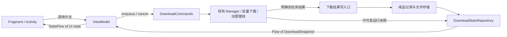

# 通信系统应用示例：下载状态驱动 UI

状态：设计提案，尚未实现。基于仓库 `1f1a264cd`；官方资料核对日期：2026-09-06。

本文是[通用通信系统](android-ui-communication.md)的下载业务接入示例，不定义通用系统的模块边界。
下载领域采用 **Repository + Flow + ViewModel + 生命周期感知渲染**。
下载引擎提交业务结果，Fragment / Activity 观察当前状态。对本需求，“完成之后变成重新下载”
是一条可持续查询的状态规则；页面不需要恰好接到某次完成通知才能正确显示。

本文针对同进程通信。它不承担后台任务调度或跨进程消息传输，也不承诺进程死亡后下载继续运行。
设计中的类型和代码是接口草案，尚未加入 Gradle 或生产源码。

## 1. 仓库现状与要解决的问题

| 代码 | 已核对的行为 | 设计约束 |
|---|---|---|
| `ArtworkV3ViewModel.startProgressPolling()` | 每 300ms 读取 Manager；当前作品不在队列中便设为 Done | 队列消失不能作为成品成功的证明；任务结束需要明确结果 |
| `ArtworkV3ViewModel.triggerDownloadedCheck()` | 合并 `Common.isIllustDownloaded` 与记录存在判断，并缓存 Boolean | 初始未知、部分完成、记录失效不能都折叠成 Boolean |
| `ArtworkV3Fragment.setupNavBar()` | 注册全局 `DOWNLOAD_FINISH` 接收器，再触发刷新 | 改成按目标订阅，减少无关作品唤醒与页面接线 |
| `Manager.startDownloadChain()` 成功回调 | 先安排移出队列，写记录，再尝试 `finishWrite()`；提交失败被记录后继续收尾 | 新状态必须以成品实际提交结果为准，同时保持失败能结束任务的能力 |
| `UgoiraDownloadRecord.record()` | 成品完成后记账；约定不抛异常，避免上游误删已提交成品 | ZIP / 下载字节结束不等于 GIF / MP4 成品完成；索引失败不能走文件 abort |
| `ManagerReactive` | 已有失效信号与 Flow；内容快照是可变 DownloadItem 的浅拷贝 | 复用适配入口；对外发布前必须建立一致的不可变快照 |
| `DownloadDao` / `RecordedPageProbe` | 已有作品与页码索引、同页多条候选和文件可读性探测 | 保留索引查询、旧数据回填兼容以及文件验证 |
| `ServicesProvider` | Application 构造、持有普通服务类；构造函数廉价 | 服务注册在既有容器，通过构造函数注入 ViewModel |

`DoneListV3Fragment` 顶部注释仍写 Room Flow，但实际 `runDoneListFlow()` 使用
`ManagerReactive.doneTableInvalidations`。设计以执行代码为准。

`ManagerReactive` 和 action queue 文档记录了 Room 高频写入下失效通知异常的历史。
这次没有复现，不能将其推广成 Room 的普遍缺陷，也不能直接删掉已有兜底。

## 2. 三类通信各用一种明确契约

| 语义 | API | 交付要求 |
|---|---|---|
| 命令：下载、取消、重试 | `suspend` 方法与有类型的返回结果 | 调用方知道是否被接受；需要持久化的命令提交后才返回 Accepted |
| 状态：文件可用性、排队、进度、失败 | Repository 暴露 `Flow<Snapshot>`；页面 VM 暴露 `StateFlow<UiState>` | 新订阅者可恢复当前值；允许跳过中间进度；多个页面独立观察 |
| 可丢失的观测信息：调试、非关键提示 | 按领域可选的 `SharedFlow<Notice>` | 明示 best-effort、replay 和溢出策略；不用于关键业务提交 |

需要最终执行的副作用进入持久化队列，并配合幂等、重试、必要的确认机制。
普通 `SharedFlow` / `Channel` 不提供跨进程重启的可靠交付或 exactly-once。
无订阅者时，`SharedFlow` 的额外缓冲不会替未来页面保存消息；`replay=1` 保存的也只是
最近一条通知，不能代表所有作品的下载状态。[SharedFlow 官方契约](https://kotlinlang.org/api/kotlinx.coroutines/kotlinx-coroutines-core/kotlinx.coroutines.flow/-shared-flow/)

不引入 `AppEventBus<Any>`、字符串 topic、反射分发或能任意 `post()` 的全局事件中心。
跨业务复用上述通信约定，各领域保留自己的类型。Fragment Result / Activity Result
适合页面结果与授权返回；长生命周期下载服务通过 Repository 与页面通信。

## 3. 模块与依赖方向



通用机制放在 `:communication`；下面的下载类型与纯状态归约放在 app 的下载领域包，
将来下载领域整体模块化时再移动，不为这个示例单独新增 Gradle module：

```text
app/.../download/state/domain/
  api/       DownloadStateSource, DownloadCommands, DownloadSelection
  model/     DownloadSnapshot, LocalAvailability, TransferState, AttemptId
  internal/  状态归约与选择范围聚合（纯函数）
  test/      状态、并发结果与范围聚合的契约测试

app/.../download/state/
  DefaultDownloadStateRepository.kt  组合运行状态、成品记录、文件验证
  LegacyDownloadEngineAdapter.kt     适配 Manager 与 ManagerReactive
  DownloadRecordStore.kt             既有 Room 表的投影与写入适配
  DownloadArtifactVerifier.kt        MediaStore / SAF 文件验证
  DownloadResultWriter.kt            下载执行方使用的结果写入口
```

通用通信模块不引用 Pixiv API 模型、Activity、Room、OkHttp。UI 和具体引擎依赖下载领域契约。
`Downloads` 保持文件规划与存储门面的职责，下载成功的业务含义放在结果写入口。
`ServicesProvider` 增加服务访问口，Application 构造一个实现实例；ViewModelFactory 注入
只读状态源与命令接口。核心服务使用普通 class；无需为此引入新的 DI 框架。

这沿用 actionqueue 的存储/执行适配边界，以及 websocket 的只读状态接口和旧回调防护。
持久化继续使用下载领域既有数据库；不为通信再创建一份“已下载数据库”。

## 4. 先定义“下载完成”的业务范围

界面订阅 `DownloadSelection`，至少包含作品类型、作品 ID 和目标页集合。
整作品按钮需要所有目标页可用，单页按钮只需该页可用。相同数字的小说 ID 与插画 ID
必须区分。页集合在入队时冻结，不能下载到一半从可变作品对象重新推导。

成品还有表示形式：静态图、GIF、MP4；ZIP 缓存不属于可交付动图。将来需要精确区分
分辨率/格式时，使用有类型的 artifact variant。现有记录不能证明的分辨率标为未知，
不能从当前设置反推历史文件的格式或质量。

首批采用的产品语义：整作品全部目标页存在可用成品时显示“重新下载”；只完成部分页
显示“继续下载”。历史徽标若继续表达“曾下载过任意一页”，通过独立投影保留该语义。
这项语义比当前“有一条记录就 Done”更严格，应作为明确的产品行为变化验收。

“重新下载”的命令也必须实际请求重下：显式 `ForceRedownload` 绕过已有记录的 Skip
判断，并采用指定的安全替换/另存策略；“继续下载”只补缺失页。仅换按钮文字而再次
被 Skip 策略跳过，不满足需求。设置中的分辨率选择仍然有效。

## 5. 将本地可用性和本次任务状态分开

```kotlin
// 核心类型草案；Selection / Request 等按第 4 节建立受校验的值对象。
interface DownloadStateSource {
    fun observe(selection: DownloadSelection): Flow<DownloadSnapshot>
    suspend fun refresh(selection: DownloadSelection)
}

interface DownloadCommands {
    suspend fun enqueue(request: DownloadRequest): EnqueueResult
    suspend fun cancel(attemptId: AttemptId): CancelResult
}

data class DownloadSnapshot(
    val local: LocalAvailability,
    val transfer: TransferState,
)

sealed interface LocalAvailability {
    data object Checking : LocalAvailability
    data object Missing : LocalAvailability
    data class Partial(val available: Int, val required: Int) : LocalAvailability
    data object Available : LocalAvailability
    data class Unavailable(val reason: AvailabilityProblem) : LocalAvailability
}

sealed interface TransferState {
    data object Idle : TransferState
    data class Queued(val id: AttemptId) : TransferState
    data class Running(val id: AttemptId, val percent: Int?) : TransferState
    data class Finalizing(val id: AttemptId) : TransferState
    data class Failed(val id: AttemptId, val reason: DownloadFailure) : TransferState
    data class Cancelled(val id: AttemptId) : TransferState
}
```

`Available` 表示目标范围已具备可用成品；`Idle` 只表示没有执行中的任务，不表示成功。
初始值为 `Checking + Idle`，不能默认“未下载”。读取失败进入 `Unavailable`，
不要 `catch { emit(false) }`。IO/权限错误映射为领域原因，异常本体留在诊断日志；协程
取消继续抛出 `CancellationException`。

成功后状态通常为 `Available + Idle`。重新下载失败可以是 `Available + Failed`：
旧成品仍可用，本次失败另行显示。若后端替换过程确实破坏了旧成品，必须依据重新验证的
结果转为 Partial / Missing，不能无条件保留 Available。

`Snapshot` 不保存界面文案、资源 ID、Activity 或 DownloadItem。集合需防御性复制，
内部元素也必须是不可变值；Kotlin 的只读 `List` 类型本身不保证底层不会被修改。

### 按钮投影规则（按顺序）

| 条件 | 显示 | 点击 |
|---|---|---|
| Queued | 等待下载 | 禁止重复入队，取消使用独立入口 |
| Running | 下载中 / 百分比；未知总量显示不定进度 | 禁止重复入队 |
| Finalizing | 保存中 / 转码中 | 禁止重复入队 |
| Unavailable | 检查失败 / 需要授权 | 刷新或启动授权流程 |
| Available | 重新下载 | ForceRedownload；若本次失败，附加失败提示 |
| Partial | 继续下载 | 只补缺失页 |
| Missing + Failed / Cancelled | 重试下载 | 新建一次尝试 |
| Missing + Idle | 下载 | 正常入队 |
| Checking | 检查中 | 暂停下载操作 |

一帧 Snapshot 通过纯函数投影成 UI state。异步状态不可能与文件系统每一瞬间完全一致，
命令入口仍须再次校验权限、去重与文件状态，不能信任按钮上一次的判断。

## 6. 成功边界、并发与恢复契约

**成功顺序：**

1. 完成网络写入，执行必要的转换；此时可以到 Finalizing，不能到 Available。
2. 文件 backend 的 `finishWrite()` / `onFinish()` 成功，使最终产物可用。
3. 写入成品记录，再发布该目标的新快照；整作品需覆盖所有要求的成品。
4. 将任务收敛到明确终态；诊断通知在此之后尽力发送，不影响已提交文件。

文件系统与 Room 无法通过一个普通数据库事务原子提交。文件提交成功但写库失败时，
内存可表达“成品可用、索引待修复”（附加持久化健康状态），不得调用 abort 删除成品。
跨重启恢复要利用/扩展现有 stage manifest 或持久化 journal：写文件前记录目标和 attempt，
确认文件和索引均提交后再清理；启动时核对中间态并幂等修复。
未覆盖 journal 的 legacy 路径只能通过文件扫描重建，不能宣称状态一定可恢复。

普通图片现有 `insertDownload → finishWrite` 顺序需要调整。调整时同步检查
`QueueDownloadManager.awaitIllustSettled`：它也依赖队列消失。用显式结算结果替换该依赖，
失败照样结算，不能简单把 remove 移到可能抛异常的末尾而重新引入队列卡死。
动图的转码任务必须连续持有同一次 attempt，ZIP 离开 Manager 队列后仍处于 Finalizing。

**防止旧结果污染：** 每次请求携带稳定 request ID；新尝试使用新的 `AttemptId`。
重复提交同一 request ID 返回原尝试；相同目标的活动任务按明确规则返回 AlreadyRunning。
旧尝试的延迟进度/失败不能覆盖新尝试，类似 websocket 的 epoch 防护。
已提交的旧成品可按记录参与可用性计算，但不能修改新尝试的运行状态。
重叠页的整作品/单页任务在 artifact 层串行化或复用执行，禁止两个写入者同时替换同一目标。

进度回调与终态转换在一致的同步边界内更新不可变快照；临界区只处理内存，不做 IO。
`StateFlow` 的线程安全不代表“检查 attempt → 更新多个字段 → 落库”天然原子。
验证文件的异步结果也携带 revision：若期间发生重下、删除或配置变化，丢弃旧探测结果并重查。

**负载控制：** 进度允许合并中间值，避免每次读字节都入库；命令、失败、提交结果不能进入
会 DROP_OLDEST 的进度队列。不得让慢页面阻塞文件提交。需要 actor 时采用有界队列和
显式入队失败/挂起契约，不把每个回调转换成一个无界 `launch`。

**恢复边界：** 页面重建后从 Repository 取当前快照；进程重建后从成品记录、journal 和
既有持久化下载队列重建。残留 Running 按引擎的恢复策略重排或标记中断，绝不能一直
显示下载中。StateFlow 只负责进程内状态，下载的持续执行仍由原引擎管理。

本地文件当前共享存储时，不额外虚构账号隔离；任务如果使用账号凭证，则沿用 actionqueue
的 owner 约束，避免换号后旧任务使用新账号权限。未来私有产物才在 artifact key 中增加 owner。

## 7. 数据观察与生命周期

Room 可观察查询是常规实现选项；表内任意行更新可能使查询重新执行，投影后需要去重。
[Room 异步查询文档](https://developer.android.com/training/data-storage/room/async-queries)

本仓库首批保留 `ManagerReactive` 的失效适配，把它封装在 Repository 内。失效信号只表示
“重新取当前状态”，不是业务结果。最新信号可以合并，因为事实保存在记录/运行状态中。
发布和订阅需保证首次取快照与注册监听之间没有丢更新窗口；可复用已初始化的 replay tick。
观察必须无副作用，不得在 `collect` / `onStart` 中启动下载。

完成、删除、清空、导入、重命名、回填、权限/存储配置变更都要使相应目标失效。首批审计
`pokeDoneTable` 所有写路径；后续逐步替换成携带目标 key 的失效，以免每页进度让所有页面查库。
同目标多个观察者共享探测，结束订阅后释放缓存项；全局活动任务表仅保留活动任务，不无限
积累所有历史作品。慢速文件探测在注入的 IO dispatcher 执行，并限制并发。

记录存在不等于文件可读。按目标重新订阅、恢复可见、授权/配置变化时执行验证；外部文件
管理器删除不会自动使 Room 失效。前台即时同步可在 backend 支持时接 ContentObserver /
文件监听，否则明确只有下一次 refresh/恢复可见时发现。查询错误与确定不存在必须区分，
现有 `RecordedPageProbe` 将错误按 false 返回的“是否跳过下载”语义不能直接当作 UI 真值。

下面示意 ViewModel 接线；`toButtonUiState`、`DownloadButtonUiState` 由第 5 节规则实现：

```kotlin
class DownloadButtonViewModel(
    private val selection: DownloadSelection,
    private val states: DownloadStateSource,
) : ViewModel() {
    val uiState = states.observe(selection)
        .map(::toButtonUiState)
        .stateIn(
            scope = viewModelScope,
            started = SharingStarted.WhileSubscribed(
                stopTimeoutMillis = 0,
                replayExpirationMillis = 0,
            ),
            initialValue = DownloadButtonUiState.Checking,
        )

    // 恢复可见时要求校验外部文件；Repository 内合并相同目标的并发 refresh。
    fun refresh() {
        viewModelScope.launch { states.refresh(selection) }
    }
}
```

官方通常建议 `WhileSubscribed(5_000)`。此处针对 ViewPager 缓存邻页以及既有探测成本，
选择 0 秒停止并清掉 replay，重新可见先显示 Checking，避免短暂显示旧的“重新下载”。
这是本项目的取舍；普通屏幕和廉价上游可以选 5 秒宽限。[Android Views 架构建议](https://developer.android.com/topic/architecture/views/recommendations-views)

```kotlin
// Fragment.onViewCreated：普通页面用 STARTED；当前详情 ViewPager 按需用 RESUMED。
viewLifecycleOwner.lifecycleScope.launch {
    viewLifecycleOwner.repeatOnLifecycle(Lifecycle.State.RESUMED) {
        viewModel.refresh()
        viewModel.uiState.collect { state ->
            renderDownloadButton(state)
        }
    }
}
```

Activity 使用自己的 `lifecycleScope` / `repeatOnLifecycle(STARTED)`；Fragment 使用
`viewLifecycleOwner`，绑定销毁时停止渲染。授权流程通过 UI 的 Activity Result API 处理，
成功后重新提交命令；命令被接受后再显示 Queued。替换当前 `triggerDownload(activity)`，
让 ViewModel 不需要 Activity 参数。
[生命周期协程文档](https://developer.android.com/topic/libraries/architecture/coroutines)

Repository 的预期读写失败作为状态/返回值表达，并支持 refresh 后恢复；不要简单在
`stateIn` 前 `catch { emit(error) }` 后任由上游永久结束。未预期异常需记录并进入可恢复的
观察路径。任务执行作用域独立于页面订阅，页面 STOP 或销毁只取消观察。

## 8. 迁移顺序与验收

1. 基于 `:communication` 建立下载领域契约和状态归约；接入 `ServicesProvider` 与可替换的存储/引擎适配器。
2. 补齐明确的成功/失败/取消与成品提交边界，审计普通图片、动图和批量等待路径；建立
   attempt 防护与必要恢复记录。此步骤完成前，新 UI 不能假装已具备更强的成功语义。
3. `ArtworkV3ViewModel` 的下载部分改用状态源；授权移至 UI，删除该部分轮询、刷新 tick
   和 Boolean 缓存；Fragment 移除下载完成广播订阅，渲染层承接按钮及无障碍文案。
4. 逐页迁移其他 Fragment / Activity 与列表徽标。旧广播可由兼容出口暂时继续发给 legacy
   消费者，新旧页面共用事实来源；全部迁移后再移除兼容出口。

生产实现必须覆盖以下行为测试；本次设计文档没有执行这些测试：

| 场景 | 必须成立 |
|---|---|
| 完成时无人订阅，稍后打开页面 | 从持久化记录与文件状态得到重新下载 |
| 旋转、切后台、ViewPager 切页 | 无旧 View 引用；恢复状态正确；隐藏邻页不做昂贵探测 |
| 同作品两个页面；另一个作品完成 | 两页都收敛到相同结果；无关目标不发生按钮变化 |
| 多页只下部分；GIF 尚在转码 | Partial / Finalizing，不能 Available |
| 队列项移除、入队被拒、SAF 授权取消 | 均不能据此宣告下载成功 |
| EOF 后 `finishWrite` 失败 | 明确失败并结算，不能产生可用成品记录 |
| 文件提交后 DB 失败；各提交窗口杀进程 | 保留成品，journal/重建幂等修复，不误 abort |
| 重新下载失败、旧成品还在 | Available 与 Failed 并存 |
| 连点、旧任务迟到回调、重叠页请求 | 去重正确；旧回调不覆盖新尝试；无并发破坏文件 |
| 外部删除、SAF 失权、旧记录未回填 | 重新验证；错误不伪装成不存在；保留回填兼容 |
| 高频进度、慢订阅者、大下载历史 | 内存有界、写入不等页面、最终快照正确 |
| 真的点击重新下载 | 不被 Skip 吞掉，执行要求的重下策略 |

纯状态/并发测试使用 `kotlinx-coroutines-test` 虚拟时间；共享 stateIn 的测试必须有活动
collector。Room 适配与 journal 需要实际数据库集成测试；生命周期与文件 backend 使用
对应 Android 测试。编译检查覆盖新模块、app 以及与批量/动图接口相关的已有测试。

首批完成的判断是：用户从任意入口下载，在任意相关页面看到正确按钮；页面错过通知或
经历重建也能恢复；明确失败不会变成成功。代码质量由这些可验证契约保障。
