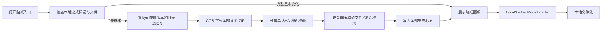

# Sticker 下载、就绪与本地展示

聊天和广场共用本系统。Pixiv 作品评论继续使用自己的 emoji/stamp 实现。
数据协议沿用 fived/Weaver 的 `stickers-version`、`stickers?type=`、
`pkgList`、`groupList`、`stickerId`、`media.resourceList`。

## 数据流



API 为 `https://api.pixshaft.com/f/v1/stickers-version` 和
`https://api.pixshaft.com/f/v1/stickers?type=customized|static|animation`。
ZIP URL 必须指向 `shaft-1300933917.cos.ap-osaka.myqcloud.com/public/stickers/`，
下载客户端拒绝重定向。Tokyo 不存储或转发 ZIP 字节。
`pkgList` 保持原有字段，补充 `size` 和 `sha256` 供完整性校验。

## 三层标记

保存到应用私有的 `noBackupFilesDir/stickers`，不会随图片缓存清理，也不进入 Android 备份。

```text
stickers/
  catalog.json
  ready.json                       # 全部包完成后最后写入的 generation
  packages/<ZIP SHA-256>/
    archive.zip                    # 下载后仍保留
    downloaded.json                # URL、长度、SHA-256
    extracted.json                 # 包 SHA-256、全部解压文件的路径/长度/CRC
    files/                         # 保留 ZIP 原始目录结构
```

`customized` 和 `static` 共享两份 ZIP，按下载 URL 去重；64/128 两种尺寸全部下载。
只有所有 ZIP、所有解压标记、全部被引用的本地资源存在且校验成功，才写 `ready.json`。
开始修复/安装时先关闭总就绪标记。各标记通过临时文件、`fsync`、同目录重命名提交。
解压路径必须在目标目录内，限制单文件、总解压字节数与条目数，并检查 CRC。

进程第一次准备资源时，完整验证 ZIP SHA-256 和解压文件 CRC。之后每次打开入口在 IO
线程检查全部文件及标记的存在、长度、修改时间；文件未变化时复用本次进程已验证的结果，
避免重复读数百 MB。文件丢失或变化则重新校验和修复。网络不可用时，已保存的完整目录和
资源仍可通过验证进入就绪状态。失败包重试会复用已通过校验的 ZIP。

下载由应用作用域中的单个任务串行管理。聊天、广场或多次点击加入同一任务；关闭弹窗不
取消下载，避免旋转屏幕或切换页面反复下载。面板观察状态，退出后停止观察；加载中只显示
进度，失败显示原因与重试，只有 Ready 才构造贴纸网格。

## Glide 与消息

Glide 输入是 `LocalSticker(stickerId, generation, resourceSize)`，只有本地 `ModelLoader` 能处理。
Fetcher 返回 `DataSource.LOCAL` 的文件流；没有转换为 `GlideUrl` 的路径、没有网络备用加载。
选择器及广场回应图标固定读取本地 64 档资源，聊天消息固定读取本地 128 档资源，
与 View 的物理像素和屏幕密度无关。缓存键含资源 generation 和资源尺寸，允许内存复用，关闭重复的 Glide 磁盘缓存。
资源列表中的 256 档未包含在 ZIP 时，选择已有的 128 档；不请求它的 URL。

聊天 WS/历史增加可选的 `sticker_id` 十进制字符串；服务端 SQLite 使用 TEXT，Android
使用 Long，避免 JS 64 位 ID 精度损失。聊天 Room 数据库通过 3→4 的加列迁移保留历史。
旧客户端仍能看到 `[贴纸]` 文本。广场新增 `reactions/stickers/{stickerId}`，服务端校验
目录中的 ID，返回 `stickerId`，客户端使用相同本地图片组件展示。

## 诊断

正式版与调试版均输出 `Sticker-System`，无需打开 Timber 调试开关：

```sh
adb -s 37261FDJH004FJ logcat -v time -s Sticker-System
```

关键事件：`prepare_start` / `prepare_join`、`metadata_start` / `metadata_complete`、
`versions`、`zip_check`、`download_start` / `progress` / `download_verified`、
`download_marker`、`extract_start` / `extract_verified` / `extract_reused`、
`gate_closed` / `gate_ready` / `gate_reused`、`panel_requested` / `panel_blocked` /
`panel_open`、`sticker_selected`、`installation_failed` / `local_file_failed`。
每个资源版本首次读取 64/128 档分别记录 `local_resource_resolved source=LOCAL`，包含尺寸和本地文件路径。
进度日志最多每两秒一条；错误保留异常及文件或贴纸 ID，日志不含会话凭证。

## 选择器容器与滚动

Post 使用 witstudio 的 `WitBottomSheet`，复用 Material 的拖拽、返回与嵌套滚动。聊天使用输入框下方的内嵌选择器，复用旧版 `BottomPanelCoordinator` 的键盘切换、返回关闭、消息区点击收起和键盘高度。两种入口共用加载门禁、分类与本地资源网格。
手机贴底、宽屏最大 640dp。内容高度有界，网格自行滚动。贴纸 sheet 表面不垫底部安全区，RecyclerView 的 bottom padding 为导航栏/键盘 inset + 8dp，clipToPadding=false；滚动中图片可经过手势区域，到底时最后一排完整停在安全区上方。
分类直接复用小说阅读器 bg_reader_segment_track / bg_reader_segment_option：42dp 轨道、36dp 选中块，外围保留 48dp 热区；宽度随文字收紧，长文案时横向滚动。选中背景使用宿主 colorPrimary，文字使用 V3Palette.onPrimary，避免 Material 指示器默认 tint。不显示标题；左侧关闭与右上角分类在同一行。
同一 sheet 只建立一个 RecyclerView 和 adapter，目录仅整理一次，分别保存三个分类的滚动位置；重复点击当前 tab 不触发刷新。
选择器关闭时取消观察，图片离屏即清理 Glide 请求；未挂载的 View 不解码图片。每格 48dp（8dp 内边距，图像约 32dp），Pixel 8 约 8 列、6 行；只读取 64 档本地资源。

选择器测试覆盖日夜、320dp 窄屏、两倍字号、Ready/Failed 门禁、tab adapter 复用和重复点击无刷新；使用原生图形引擎验证四种主题的选中底与宿主主色一致，正常字号轨道保留 48dp 热区且不撑满整行。

聊天消息贴纸显示为 64dp，继续读取本地 128 像素资源；双方贴纸均无气泡背景、阴影和内边距。带引用时仅引用块保留主题浅色底与可读文字，发送状态和长按操作照常保留。

聊天内嵌面板没有关闭行、拖拽条或遮罩，发送贴纸后保持展开。导航栏留白由原有键盘协调器单独负责，网格不重复添加 IME inset。隐藏面板或页面停止时移除内容 View，释放 Glide 请求；同一资源版本重新检查就绪后复用三个分类的滚动位置。
